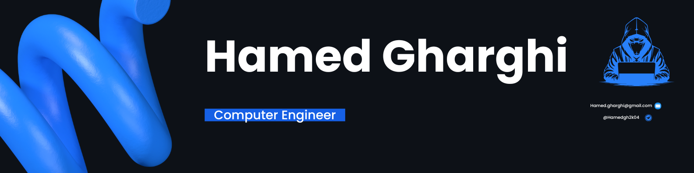

  

<i>Welcome to my GitHub profile!</i>

---

 

  

 

  
  

 

  

 

## 🌟 About Me

I thrive on tackling diverse and challenging projects that push my problem-solving abilities and allow me to learn and grow. Whether it's developing applications, writing efficient code, or contributing to open-source communities, I am always eager to embrace new opportunities and enhance my skills.

 

## 🛠️ Skills & Technologies

### 💻 Programming Languages

  
  
  
  

### 🌐 Web Development

  
  
  
  
  

### 📱 Mobile Development

  
  
  

### 💾 Database

  
  
  

### 🔧 Development Tools

  
  
  
  

### 🔒 Security & Networking

  
  
  
  

### 🤖 Automation & Bots

  
  

### 🖥️ Operating Systems

  
  
  

 

## 📚 Education

- **University**: Yasuj University, Iran
- **Degree**: Bachelor's in Computer Engineering
- **Current Term**: 6th Term

 

## 🏆 Certificates

  
<b>Beginner Telegram Bot Development Python</b>

  <ul>
    <li>Issuer: FaraDars</li>
    <li>Certificate ID: DA9120AA</li>
    <li>Date: July 05, 2025</li>
    <li>Instructor: Eng. Pouya Jamali</li>
    <li><a href="https://faradars.org/verify/DA9120AA?lang=en">View Certificate</a></li>
  </ul>

  
<b>Mastering Freelancing: A Guide to Iranian and Global Platforms like Karlenser and Guru</b>

  <ul>
    <li>Issuer: FaraDars</li>
    <li>Certificate ID: 9E6892FF</li>
    <li>Date: July 05, 2025</li>
    <li>Instructor: Mr. Amin Salahi</li>
    <li><a href="https://faradars.org/verify/9E6892FF?lang=en">View Certificate</a></li>
  </ul>

  
<b>Foundations of Cryptography and Information Security</b>

  <ul>
    <li>Issuer: FaraDars</li>
    <li>Certificate ID: 4B081886</li>
    <li>Date: July 04, 2025</li>
    <li>Instructor: Eng. Sasan Soltan Ahmadi</li>
    <li><a href="https://faradars.org/verify/4B081886?lang=en">View Certificate</a></li>
  </ul>

  
<b>Network+ Essentials</b>

  <ul>
    <li>Issuer: FaraDars</li>
    <li>Certificate ID: EE5524D7</li>
    <li>Date: July 04, 2025</li>
    <li>Instructor: Eng. Manoochehr Babaei</li>
    <li><a href="https://faradars.org/verify/EE5524D7?lang=fa">View Certificate</a></li>
  </ul>

  
<b>Mastering Data Visualization with PyQtGraph in Python</b>

  <ul>
    <li>Issuer: FaraDars</li>
    <li>Certificate ID: 78DD2AD7</li>
    <li>Date: March 31, 2025</li>
    <li>Instructor: Eng. Sepehr Kouzegaran</li>
    <li><a href="https://faradars.org/verify/78DD2AD7?lang=en">View Certificate</a></li>
  </ul>

  
<b>Fundamentals of Programming</b>

  <ul>
    <li>Issuer: FaraDars</li>
    <li>Certificate ID: 65F00444</li>
    <li>Date: March 28, 2025</li>
    <li>Instructor: Dr. Seyed Mostapha Kalami Heris</li>
    <li><a href="https://faradars.org/verify/65F00444?lang=en">View Certificate</a></li>
  </ul>

  
<b>Python Programming Essentials</b>

  <ul>
    <li>Issuer: FaraDars</li>
    <li>Certificate ID: 625F39A4</li>
    <li>Date: March 28, 2025</li>
    <li>Instructor: Dr. Pejman Eqbali</li>
    <li><a href="https://faradars.org/verify/625F39A4?lang=en">View Certificate</a></li>
  </ul>

  
<b>Python Libraries for Machine Learning and Deep Learning</b>

  <ul>
    <li>Issuer: FaraDars</li>
    <li>Certificate ID: 38E9E531</li>
    <li>Date: March 28, 2025</li>
    <li>Instructor: Dr. Farshid Shirafkan</li>
    <li><a href="https://faradars.org/verify/38E9E531?lang=en">View Certificate</a></li>
  </ul>

  
<b>WordPress Project Mastery: Build and Launch Your Own Digital File Store</b>

  <ul>
    <li>Issuer: FaraDars</li>
    <li>Certificate ID: 00815E94</li>
    <li>Date: March 28, 2025</li>
    <li>Instructor: Mr. Shahyar Zooravand</li>
    <li><a href="https://faradars.org/verify/00815E94?lang=en">View Certificate</a></li>
  </ul>

  
<b>Mastering Git, GitHub, and GitLab: Your Ultimate Guide to Version Control</b>

  <ul>
    <li>Issuer: FaraDars</li>
    <li>Certificate ID: 3DC889F2</li>
    <li>Date: July 26, 2024</li>
    <li>Instructor: Eng. Jadi Mirmirani</li>
    <li><a href="https://faradars.org/verify/3DC889F2?lang=en">View Certificate</a></li>
  </ul>

  
<b>Excel Essentials</b>

  <ul>
    <li>Issuer: FaraDars</li>
    <li>Certificate ID: B666A755</li>
    <li>Date: July 26, 2024</li>
    <li>Instructor: Eng. Amir Reza NikKhah</li>
    <li><a href="https://faradars.org/verify/B666A755?lang=en">View Certificate</a></li>
  </ul>

  
<b>Mastering Your GitHub Profile: Essential Tips for Project Success</b>

  <ul>
    <li>Issuer: FaraDars</li>
    <li>Certificate ID: 63121FBE</li>
    <li>Date: July 26, 2024</li>
    <li>Instructor: Mr. Mohammad Zolghadr</li>
    <li><a href="https://faradars.org/verify/63121FBE?lang=en">View Certificate</a></li>
  </ul>

## 🏅 Competitions

  
<b>ICPC Asia Tehran Regional Contest 2024</b>

  <ul>
    <li><b>Team:</b> Yasouj University</li>
    <li><b>Members:</b> Hamed Gharghi, Reza Asadi, Amirreza Esmaeili</li>
    <li><b>Coach:</b> Keyvan RahimiZadeh</li>
    <li><b>Date:</b> 19-20 December 2024</li>
    <li><b>Results:</b> Thirty-fifth Place, Honorable Mention</li>
    <li><b>Scoreboard:</b> <a href="https://icpc.ir/2024/scoreboard/">View Official Scoreboard</a></li>
    <li><b>Team Photo:</b> 
      

        
      

    </li>
  </ul>

 

## 🤝 Connect with Me

  
  
  

 

  
  
  

 

  

 

  <h3>Thank you for visiting! 🚀</h3>
  
Let's connect and create something amazing together!

